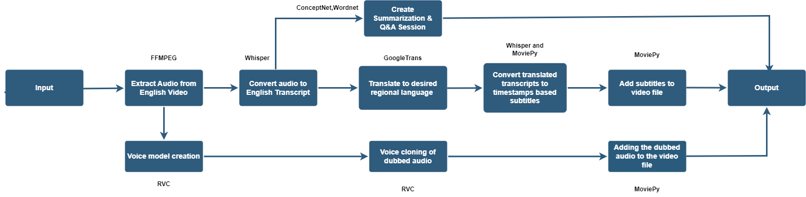

# BhashaBlend

## Overview

BhashaBlend is a comprehensive tool designed to address the diverse linguistic challenges in Indian education, ensuring inclusivity and accessibility for all learners. It leverages advanced technologies to convert educational content into multiple Indian languages and incorporates Indian Sign Language (ISL) transcription, making it a versatile aid for educators and students.

## Key Features

- **Multilingual Support**: Translates English video content into various Indian languages.
- **Indian Sign Language (ISL) Transcription**: Converts educational content into ISL for students with hearing impairments.
- **Advanced Voice Conversion**: Utilizes Retrieval-Based Voice Conversion (RVC) to maintain context and tone in dubbed audio.
- **Captioning**: Provides captions in multiple Indian languages to support accessibility.

## Project Flow Diagram

## Technologies Used

The project is entirely based on Python and leverages the following libraries and frameworks:

- [WordNet](https://wordnet.princeton.edu/)
- [Silero](https://github.com/snakers4/silero-models)
- [FFMPEG](https://ffmpeg.org/)
- [ConceptNet](https://conceptnet.io/)
- [MoviePy](https://zulko.github.io/moviepy/)
- [OpenAI Whisper](https://github.com/openai/whisper)
- [RVC AI](https://github.com/liujing04/Retrieval-based-Voice-Conversion-WebUI)
- [Gradio](https://gradio.app/)
- [Tkinter](https://wiki.python.org/moin/TkInter)
- [Pillow](https://python-pillow.org/)
- [BART](https://github.com/facebookresearch/fairseq/tree/main/examples/bart)

## Usage

### Project Flow

1. **Input Stage**: 
   - Start with an English video file.

2. **Audio Processing**:
   - Extract audio using FFMPEG and transcribe it into English using Whisper.

3. **Transcription and Translation**:
   - Translate the English transcript into the target language using GoogleTrans.
   - Convert translated transcripts into timestamp-based subtitles.

4. **Text-to-Speech (TTS)**:
   - Use Silero models for TTS to produce natural-sounding dubbed audio.

5. **Voice Cloning**:
   - Apply cloned voice to convert translated transcript into speech using RVC.

6. **Final Integration**:
   - Merge dubbed audio with video using MoviePy to produce the final output.

7. **Enhancements**:
   - Include Indian Sign Language transcription and summarization Q&A sessions using ConceptNet and WordNet.

### Google Colab Integration

To process the video in Google Colab:

1. Open the provided Jupyter notebook (`BhashaBlend.ipynb`) in Google Colab.
2. Follow the instructions within the notebook to upload your video file and process it through the BhashaBlend pipeline.

### Indian Sign Language Conversion

For ISL conversion:

1. Place the input text for sign language translation in the `input_text_main2py.txt` file located in the `ISL_Conversion` folder.
2. Run the `main2.py` script to generate the ISL transcription.

